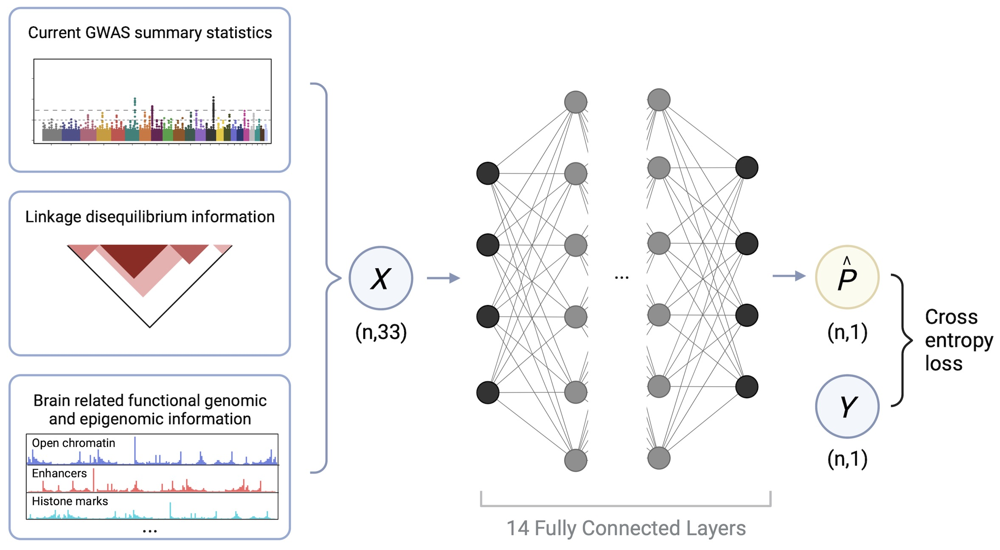

# DeepGWAS
=======================================

*DeepGWAS* to Enhance GWAS Signals for Neuropsychiatric Disorders via Deep Neural Network 
In this work, we developed a 14-layer deep neural network, DeepGWAS, to enhance GWAS signals by leveraging GWAS summary statistics (p-value, odds ratio, minor allele frequency, linkage disequilibrium score), as well as brain related functional genomic and epigenomic information (FIRE, super FIRE, open chromatin, eQTL). 

.. 
  

*DeepGWAS* is maintained by Jia Wen [jia_wen@med.unc.edu] and Gang Li [gangliuw@uw.edu].

*News and Updates*
All notable changes to this project will be documented in [this file](https://github.com/GangLiTarheel/DeepGWAS/blob/main/changelog.md).
  

*Citation*

1. https://www.biorxiv.org/content/10.1101/2022.12.20.521277v1
2. PMID: 35396580

* Proposed changes to DeepGWAS * 
1. readthedoc
